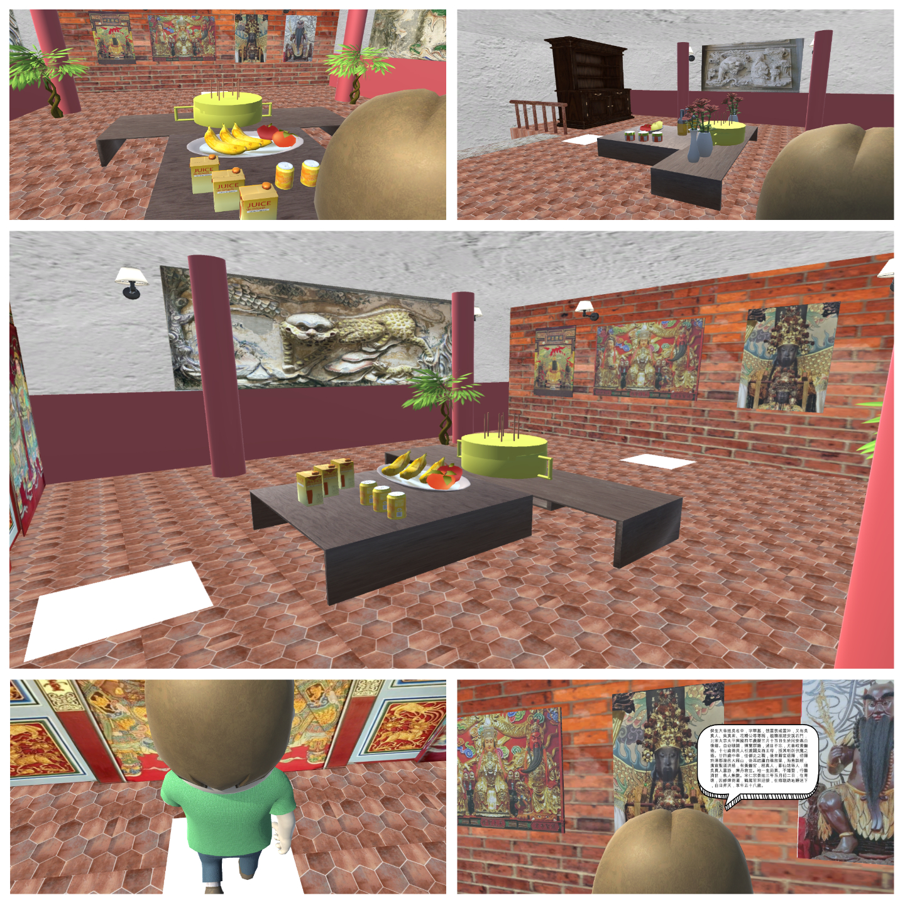
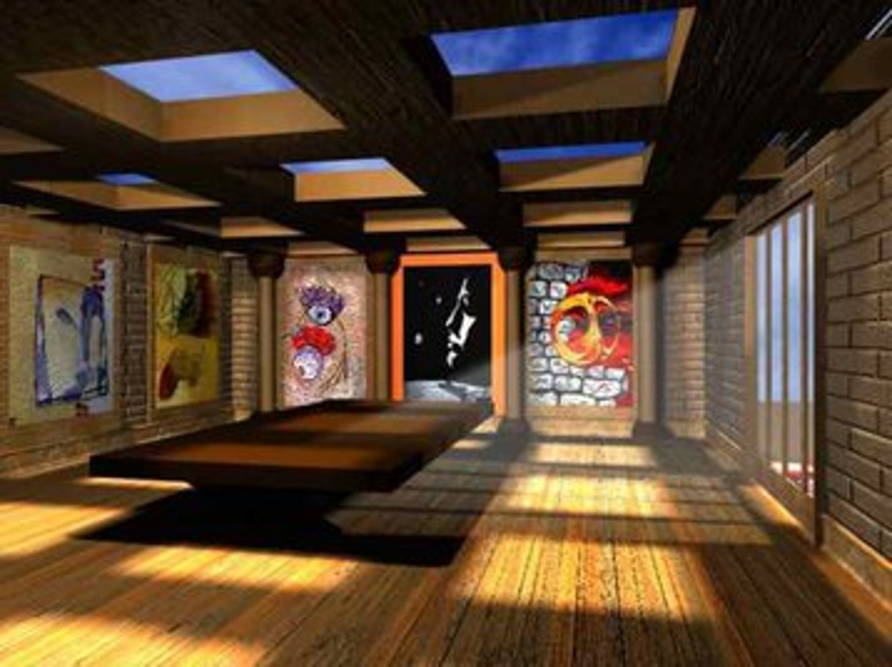

# AR博物館探索
以博物館探索作為發想，透過博物館虛擬空間探索館內文物，並以AR輔助介紹文物歷史。

虛擬博物館場景圖 (AR Museum Scene)

  
## 製作發想
- 虛擬博物館  
虛擬博物館則採用數位模擬物品及真實場景的三維模型展示,是傳統的考古技術與先進的電腦虛擬技術的結合。整個場景可以三維和互動式探索形式重現。
由于虛擬物展品和場景全部存在于電腦中， 因此，對其尺寸的大小沒有任何限制，物體的三維模型可以無限期展示，沒有物品被毀壞、 被偷竊的危險。
在虛擬博物館裏，人們不僅可以看到物品的三維模型，而且可以在電腦虛擬世界環境中進行觀賞。  

<a href="https://www.itsfun.com.tw/%E8%99%9B%E6%93%AC%E7%8F%BE%E5%AF%A6/wiki-2626875-9401755

## 介紹文字顯示
當人物到圖片前面時，圖片的介紹文字就會出現。  

➜ 虛擬博物館場景圖的右下角 (Lower Right of AR Museum Scene)

## AR模型（Vuforia）
用手機照場景裡的神祉圖片時，會出現有關於該神明的物件(ex.福德正神會出現果樹)。
